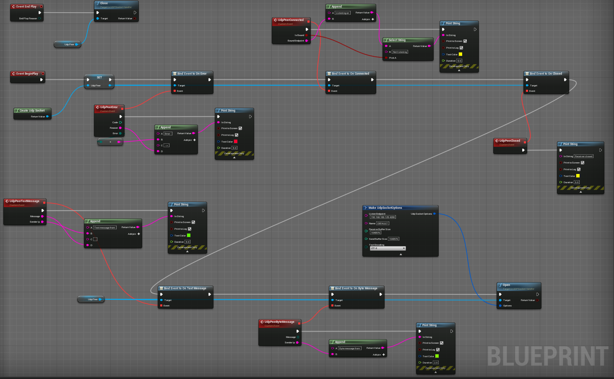

# SocketHelper


- UE plugin to handle TCP/UDP client/server socket communications
- Multi threaded implementation for each communication
- It exposes async nodes to quickly create a tcp client/server or udp socket
- Send text with specific encoding or bytes
- Utility nodes to get network informations about your machines or an ip address
- Can be used in any blueprint


[Link to the plugin in the marketplace](https://www.unrealengine.com/marketplace/en-US/product/a10b185845ee42daa3a76c0c5a9b2ad8)

# Utility


| Node | Inputs | Outputs | Note |
| ---- | ------ | ------- | ---- |
| IsSocketSupported | void | Result(Bool) | Checks whether the socket subsystem is supported by the platform | 
| Decode | Bytes(Array(Byte)), Encoding(ESocketTextEncoding) | Result(String) | Decodes an array of bytes with a specific encoding into a string |
| Encode | Str(String), Encoding(ESocketTextEncoding) | Result(Array(Byte)) | Encodes a string with a specific encoding into an array of bytes |
| IsIpv4Address | Address(String) | Result(Bool) | Checks whether the string provided is an ipv4 address |
| IsIpv6Address | Address(String) | Result(Bool) | Checks whether the string provided is an ipv6 address |
| HasNetworkInterface | void | Result(Bool) | Checks whether any network interfaces are available on the machine |
| GetLocalInterfaces | void | Result(Array(String)) | Returns the network interfaces available on the machine |
| GetMachineHostName | void | HostName(String), Result(Bool) | Returns the host name found for the machine |
| ResolveHostName | Host(String) | Success(Bool), HostIp(String) | DNS resolves an hostname into an IP |
| AddCachedHostName | HostName(String), HostIp(String) | Result(Bool) | Saves an hostname and its ip in the cache for fast resolve query |
| RemoveCachedHostName | HostName(String) | Result(Bool) | Removes an hostname and its ip from the cache |
| GetAddressInfos | HostName(String), Service(String) | Success(Bool), Result(FInfosAddr) | Finds the ips for an hostname and a specific service like smtp, www, ... |
| MakeEndpoint | Ip(String), Port(Int) | Endpoint(String), Result(Bool) | Converts an ip and a port into an endpoint |
| BreakEndpoint | Endpoint(String) | Ip(String), Port(Int), Result(Bool) | Converts an endpoint into an ip and port |

# TCP Client

```A tcp client connects to a tcp server and exchanges data using the transfer control protocol (connectionful exchange)```


    Note: Bind the events before calling "Open" to receive them properly

    If you leave empty "BindEndpoint" when calling Open, a random endpoint on your machine will be bound to establish the connection, you must provide a valid remote endpoint though

    Call "Close" to end the communication and free the memory when you are done

| Node | Inputs | Outputs | Note |
| ---- | ------ | ------- | ---- |
| CreateTcpSocketClient | void | TCPSocketHandler | Initiate a tcp client handler, save the reference into a variable to avoid garbage collection |
| Open | Options(TcpSocketOptions) | Result(Bool) | Tries to open a socket and connection with remote endpoint based on options provided |
| Close | void | Result(Bool) | Tries to close the socket and connection with remote endpoint |
| SendBytes | Data(Array(Byte)) | ByteSent(Int), Result(Bool) | Sends data to the remote endpoint and returns the amount of bytes sent |
| SendText | Data(String), TextEncoding(ESocketTextEncoding) | Sends encoded text to the remote endpoint and returns the amount of bytes sent |
| IsConnected | void | Result(Bool) | Checks whether this client is connected to a server |
| GetBoundEndpoint | void | Result(String) | Returns the current local endpoint bound for this connection |
| BindEventToOnConnected | void | BoundEndpoint(String) | Triggered when the connection is established on the local bound endpoint |
| BindEventToOnClosed | void | ClosedByClient(Bool) | Triggered when the connection was closed by the remote or the client |
| BindEventToOnError | void | Code(Int), Reason(String), Error(ESocketError) | Triggered when an error occurs, reason contains additional information |
| BindEventToOnTextMessage | void | Message(String) | Triggered when a text message is received from remote |
| BindEventToOnByteMessage | void | Message(Array(Byte)) | Triggered when a bytes message is received from remote |

## Example usage : Tcp client


<br>

# TCP Server

```A tcp server listens for incoming connections from tcp clients and communicates with them using the transfer control protocol (connectionful exchange)```


    Note: Bind the events before calling "Start" to receive them properly

    You must provided a valid "BindEndpoint" to start the server

    Call "Stop" to close the communications with clients and free memory

| Node | Inputs | Outputs | Note |
| ---- | ------ | ------- | ---- |
| CreateTcpSocketServer | void | TCPServerHandler | Initiate a tcp server handler, save the reference into a variable to avoid garbage collection |
| Start | Options(TcpServerOptions) | Result(Bool) | Starts a tcp server and listen for connections attempt |
| Stop | void | Result(Bool) | Closes the communications with connected clients and free resources |
| Pause | void | Result(Bool) | Stops listening for incoming connections, but still receives data from connected clients |
| Resume | void | Result(Bool) | Resume listening for incoming connections |
| DisconnectClient | ClientIp(String) | Result(Bool) | Closes the connection with a specific client |
| SendText | Data(String), TextEncoding(ESocketTextEncoding) | ByteSent(Int), Result(Bool) | Sends text message to all connected clients |
| SendBytes | Data(Array(Byte)) | ByteSent(Int), Result(Bool) | Sends bytes message to all connected clients |
| SendTextTo | Data(String), ClientIp(String), TextEncoding(ESocketTextEncoding) | ByteSent(Int), Result(Bool) | Sends text message to a specific connected client |
| SendBytesTo | Data(Array(Byte)), ClientIp(String) | ByteSent(Int), Result(Bool) | Sends bytes message to a specific connected client |
| IsListening | void | Result(Bool) | Returns whether the server is listening to incoming connection attempt |
| GetBoundEndpoint | void | Result(String) | Returns the local bound endpoint on which this server is listening |
| GetClientCount | void | Result(Int) | Returns the number of clients connected to the server |
| GetClients | void | Result(Array(String)) | Returns the ips of the clients connected to the server |
| BindEventToOnStart | void | BoundEndpoint(String) | Triggered when the server is started and listens on a specific endpoint |
| BindEventToOnStop | void | void | Triggered when the server is stopped |
| BindEventToOnError | void | Code(Int), Reason(String), EError(ESocketError) | Triggered when an error occurs, reason contains additional information |
| BindEventToOnConnected | void | ConnectedIp(String), Count(Int) | Triggered when a new client connects to the server |
| BindEventToOnDisconnected | void | DisconnectedIp(String), HasLostConnection(Bool), Count(Int) | Triggered when a client is disconnected from the server |
| BindEventToOnTextMessage | void | Message(String), SenderIp(String) | Triggered when a new text message is received from a client |
| BindEventToOnByteMessage | void | Message(Array(Byte)), SenderIp(String) | Triggered when a new byte message is received from a client |

## Example usage : Tcp server


<br>

# UDP Socket

```A udp peer listens for incoming messages from other udp peers and communicates with them using the user datagram protocol (connectionless exchange)```


    Note: Bind the events before calling "Open" to receive them properly

    If you do not provide a "BindEndpoint", you won't be receiving message, but will still be able to send them

| Node | Inputs | Outputs | Note |
| ---- | ------ | ------- | ---- |
| CreateUdpSocket | void | UDPSocketHandler | Initiate an udp socket handler, save the reference into a variable to avoid garbage collection |
| Open | Options(UdpSocketOptions) | Result(Bool) | Tries to create and eventually bind the socket to a local endpoint |
| Close | void | Result(Bool) | Tries to close the socket |
| SendBytes | Data(Array(Byte)), RemoteEndpoint(String) | ByteSent(Int), Result(Bool) | Sends data to the remote endpoint and returns the amount of bytes sent |
| SendText | Data(String), RemoteEndpoint(String), Encoding(ESocketTextEncoding) | ByteSent(Int), Result(Bool) | Sends encoded text to the remote endpoint and returns the amount of bytes sent |
| IsListening | void | Result(Bool) | Returns whether the socket is listening for incoming messages |
| BindEventToOnConnected | void | IsBound(Bool), BoundEndpoint(String) | Triggered when the socket is created and eventually bound to a local endpoint for incoming messages |
| BindEventToOnClosed | void | void | Triggered when the socket was closed |
| BindEventToOnError | void | Code(Int), Reason(String), Error(ESocketError) | Triggered when an error occurs, reason contains additional information |
| BindEventToOnTextMessage | void | Message(String), SenderIp(String) | Triggered when a new text message is received from a peer |
| BindEventToOnByteMessage | void | Message(Array(Byte)), SenderIp(String) | Triggered when a new byte message is received from a peer |

## Example usage : Udp peer



<br>

# Async nodes


    Note: These compact nodes return a handler to access the same feature as the traditional approach described above

    Calling these async nodes again won't create another socket unless you closed the previous one

| Node | Inputs | Outputs | Note |
| ---- | ------ | ------- | ---- |
| AsyncTcpServer | Options(TcpServerOptions) | Handler(TCPServerHandler), Result(TcpServerResult) | Initiate and starts a tcp server with provided options |
| AsyncTcpSocket | Options(TcpSocketOptions) | Handler(TCPSocketHandler), Result(TcpSocketResult) | Initiate and opens a tcp socket with provided options |
| AsyncUdpSocket | Options(UdpSocketOptions) | Handler(UDPSocketHandler), Result(UdpSocketResult) | Initiate and creates a udp socket with provided options |